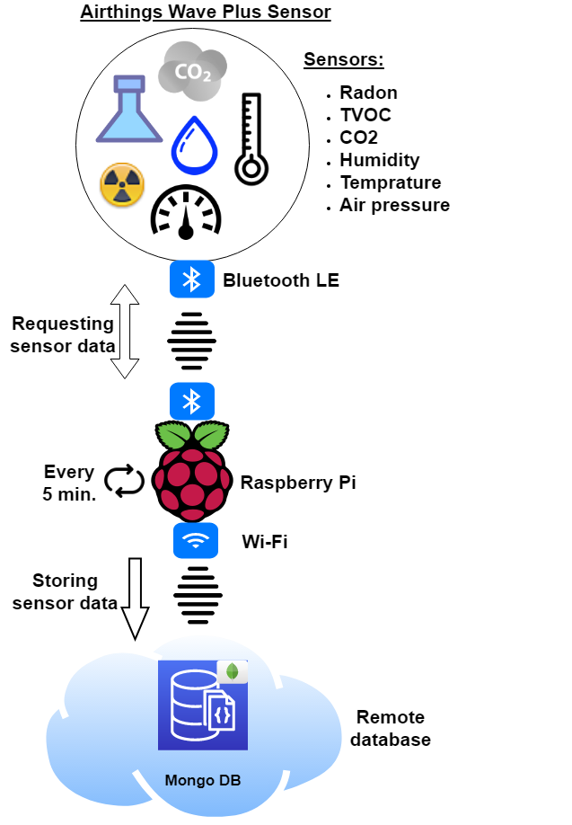

# Tool to write sensor data of Airthings Wave Plus to MongoDB


This tool reads the sensor data of ['Airthings Wave Plus'](https://www.airthings.com/wave-plus) to MongoDB for future analysis (see schema below).

The ['code'](https://www.airthings.com/resources/wave-plus-raspberry-pi) is based on project published by Airthings and extended to run standalone and store the received data to MongoDB.


##### Example of MongoDB entry
```
{
    "_id" : ISODate("2020-XX-XXXXX:XX:XX.XXXZ"),
    "VOC_lvl" : 165.0,
    "radon_st_avg" : 23,
    "CO2_lvl" : 559.0,
    "temperature" : 27.71,
    "pressure" : 1005.64,
    "radon_lt_avg" : 27,
    "humidity" : 60.5
}

```

##### Project overview


