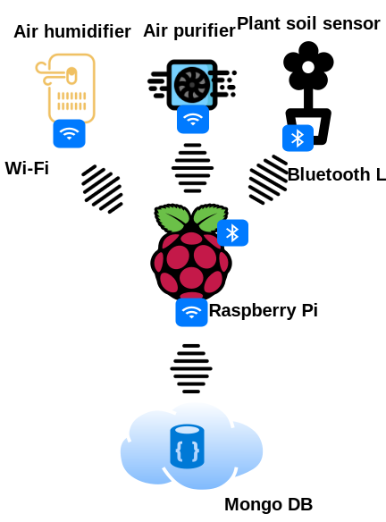

# Collecting data from plants and indoor air treatment devices

In this article, I would like to share my experience in how to collect sensor data from different devices in my home and store this data for future analysis in a Mongo Database. The picture below shows the current architecture. 

The main components are a Raspberry Pi Zero for data collection and connecting between different systems. Included in my setup are a plant soil sensor with Bluetooth LE, an air purifier with Wi-Fi,  an air humidifier with Wi-Fi, and a Mongo database in the cloud.

The main Python libraries used are ['Python-miio'](https://github.com/rytilahti/python-miio) for the air humidifier and air purifier, and ['Miflora'](https://pypi.org/project/miflora/) for the plant soil sensor.




## Xiaomi Air Humidifier sensor data collection

The air humidifier ['Xiaomi Smartmi Humidifier'](https://www.xiaomitoday.com/xiaomi-smartmi-humidifier-2-2018-review-best-humidifier-you-can-get/) offers sensor data such as: humidity, motor speed and temperature. In addition, it provides device data such as: power-on status and use time.

All of this data gets collected and stored in a remote Mongo DB.


###  Extract of 'xiaoMi_AirHumidifier.py'

```
from miio import AirHumidifierCA1

#Connect to AirPurifier
xmAH=  AirHumidifierCA1("<IP>", "<Token>")

#Get data
status = xmAH.status()
humidity=status.humidity
.
.
.
```

### Example of collected sensor data
```
{
    "_id" : "2020-XX-XX 10:54:42.064516",
    "power" : "on",
    "mode" : "OperationMode.High",
    "temperature" : 23.3,
    "humidity" : 66,
    "motor_speed" : 996,
    "use_time" : 5798924
}

```

################################################################

## Xiaomi Air Purifier sensor data collection

The air purifier ['Mi Air Purifier 2S'](https://www.mi.com/in/air2s/)  from Xiaomi offers sensor data such as: AQI, humidity, light intensity, motor speed and temperature. In addition, it provides device data such as: power-on status, filter hours used, filter hours remaining and operation mode.

All of this data gets collected and stored in a remote Mongo DB.

###  Extract of 'xiaoMi_AirPurifier.py'

```
from miio import AirPurifier, DeviceException

#Connect to AirPurifier
xm_airP=  AirPurifier("<IP>", "<Token>")

#Get data
status = xm_airP.status()
api=status.aqi
.
.
.
```

### Example of collected sensor data
```
{
    "_id" : "2020-xx-xx 10:54:36.396005",
    "aqi" : 1,
    "humidity" : 60,
    "illuminance" : 22,
    "os_on" : "True",
    "motor_speed" : 845,
    "temp" : 24.3,
    "filter_hours_used" : 209,
    "filter_life_remaining" : 94,
    "average_aqi" : 3,
    "mode" : "OperationMode.Favorite"
}

```

################################################################

## Flower care sensor data collection

The plant soil sensor ['Flower Care Smart Monitor'](http://www.huahuacaocao.com/product) offers sensor data such as: temperature, moisture, light intensity and conductivity. In addition, it provides device data such as: firmware version, name and battery level.

All of this data gets collected and stored in a remote Mongo DB.

###  Extract of 'flowerCareCollector.py'

```
from btlewrap import available_backends, BluepyBackend, \
	GatttoolBackend, PygattBackend
from miflora.miflora_poller import MiFloraPoller, \
    MI_CONDUCTIVITY, MI_MOISTURE, MI_LIGHT, MI_TEMPERATURE, MI_BATTERY


mac='C4:7C:XX:XX:XX:XX' #<--- Get MAC-Address via 'sudo hcitool lescan'
poller = MiFloraPoller(mac, GatttoolBackend)

#Get historic sensor data
history_list = poller.fetch_history()

#Get current sensor data
temp=poller.parameter_value(MI_TEMPERATURE)
moisture=poller.parameter_value(MI_MOISTURE)
light=poller.parameter_value(MI_MOISTURE)
conductivity=poller.parameter_value(MI_CONDUCTIVITY)
.
.
.
```

### Example of collected sensor data
```
{
    "_id" : ISODate("2020-XX-XXT09:09:49.712Z"),
    "temperature" : 26.7,
    "moisture" : 64,
    "light" : 2149,
    "conductivity" : 2213
}

```
################################################################

## Setting up Raspberry Pi Zero

The easiest way to install the ['Raspberry Pi OS'](https://www.raspberrypi.org/downloads/raspberry-pi-os/) is to download the 'Raspberry Pi OS (32-bit) Lite' version and flash it via ['ETCHER'](https://www.balena.io/etcher/). Detailed instruction can be found ['here'](https://www.losant.com/blog/getting-started-with-the-raspberry-pi-zero-w-without-a-monitor).


### Setting up the Raspberry Pi witout a monitor
1. After flashing with Etcher, add a file in the folder '/boot' with the name 'ssh' to activate SSH server during bootup.
2. Create the file 'wpa_supplicant.conf' (see below) under '/boot'.
3. Connect to the Pi via 'ssh pi@raspberrypi.local' from your terminal. Use 'raspberrypi-NUM.local' if you have more than one Pi.

```
#wpa_supplicant.conf

country=US
ctrl_interface=DIR=/var/run/wpa_supplicant GROUP=netdev
update_config=1

network={
ssid="Wi-Fi_SSID"
scan_ssid=1
psk="Wi-Fi_PASSWORD"
key_mgmt=WPA-PSK
}

```

### How to secure your Raspberry Pi

Changing the default password

```
passwd
```

Setting up a firewall (be careful, you can lock yourself out)

```
sudo apt install ufw
```
Allow SSH

```
sudo ufw allow ssh
sudo ufw allow 22
```
Enable firewall

```
sudo ufw enable
```

Further hardening such as: add new user with different (not-default) name and delete user pi, use SSH Key-based authentication, use Fail2Ban, make sudo require a password and how to update your packages regularly can be found on various websites.


### Setting up the Pi enviroment


```
sudo apt-get update && sudo apt-get upgrade -y

```
#### Install Python 3

```
sudo apt install python-pip python3-pip -y
wget https://bootstrap.pypa.io/get-pip.py sudo pip3 install pip
```

#### Install Xiao Mi Python Libary 
See [documentation](https://pypi.org/project/python-miio/) for further information 

```
pip install python-miio
```

#### Install Plant Care Python Libary 

```
git clone https://github.com/open-homeautomation/miflora.git
```
Install libaries with pip as needed

#### Set up cron jobs to start sensor data collection automatically after reboot

##### Example of cron launcher file 'xiaomiairhumidifier_launcher.sh'
```
#!/bin/sh

cd /
cd home/pi/xiaomi
python3 xiaoMi_AirHumidifier.py
cd /

```

```
chmod 755 xiaomiairhumidifier_launcher.sh

```

Add a launcher file to a cron job

```
sudo crontab -e

@reboot sh /home/pi/xiaomi/xiaomiairhumidifier_launcher.sh >/home/pi/logs/cronlog 2>&1
```

### Install telegraf for Pi device monitoring

```
sudo apt install -y gnupg2 curl wget
wget -qO- https://repos.influxdata.com/influxdb.key | sudo apt-key add - 
```

```
echo "deb https://repos.influxdata.com/debian buster stable" | sudo tee /etc/apt/sources.list.d/influxdb.list

```

```
sudo apt update
sudo apt -y install telegraf
```

Test if telegraf is running

```
systemctl status telegraf
```

Configure InfluxDB in 'telegraf.conf' to store device metrics and restart telegraf afterwards``

```
nano /etc/telegraf/telegraf.conf
```
```
###############################################################################
#                            OUTPUT PLUGINS                                   #
###############################################################################


# Configuration for sending metrics to InfluxDB
[[outputs.influxdb]]
  ## The full HTTP or UDP URL for your InfluxDB instance.
  ##
  ## Multiple URLs can be specified for a single cluster, only ONE of the
  ## urls will be written to each interval.
  # urls = ["unix:///var/run/influxdb.sock"]
  # urls = ["udp://127.0.0.1:8089"]#<---------------------------- Edit this
```